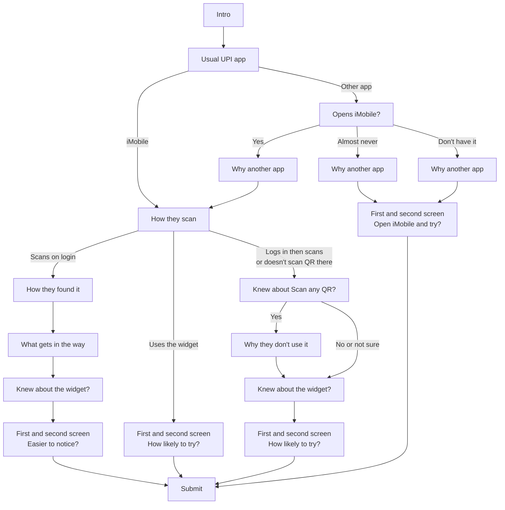

# iMobile UPI Scan & Pay — questionnaire (v11)

Schema version: `imobile-upi-scan-pay-2026-10-v11`.

The survey asks how people pay with UPI today, why another app wins when it does, and how people who open iMobile scan a QR. Everyone ends on two concept screens, then submits.

Technical branching code: `dist/rules.js`. Question wording: `dist/questions.js`.

---

## In plain English

1. **Intro** — what the survey is, how long it takes  
2. **Usual UPI app** — which app they usually pay with  
3. Then the path splits (see below)  
4. **First screen** and **Second screen** — rate each concept  
5. **Submit**

---

## High-level summary

| Who | What they see | Then |
| --- | --- | --- |
| Everyone | Intro | Usual UPI app |
| Usual app is not iMobile | Do you open iMobile in a typical month? | Why that other app is the usual one |
| Opens iMobile (usual app is iMobile, or they said they open it) | How they usually scan a QR in iMobile | Follow-ups about Scan any QR / the widget |
| Almost never open it, or don’t have it | Why the other app wins | Concept screens (“open iMobile and try”) |
| Uses the home-screen widget | — | Concept screens (“how likely to try”) |
| Already uses Scan any QR on the login screen | How they found it → what gets in the way → knew about the widget? | Concept screens (“easier to notice?”) |
| Logs in then scans, or doesn’t scan QR in iMobile | Did they know about Scan any QR? → why not, if they knew → knew about the widget? | Concept screens (“how likely to try”) |
| Everyone | First screen, then second screen | Submit |

---

## Questions in order

| Order | What we call it | Shown when | What we ask |
| --- | --- | --- | --- |
| 1 | Intro | Always | About the survey |
| 2 | Usual UPI app | Always | What app do you usually use for UPI payments? |
| 3 | Opens iMobile? | Usual app is **not** iMobile | In a typical month, do you open the iMobile app? |
| 4 | Why another app | Usual app is not iMobile (after they answer Opens iMobile?) | Why do you pay in another app instead of iMobile? (select all that apply) |
| 5 | How they scan | Usual app is iMobile, **or** they open iMobile | When you pay a QR from iMobile, what do you usually do? |
| 6 | How they found Scan any QR | They already scan on the login screen | How did you find Scan any QR on the login screen, before the PIN? |
| 7 | What gets in the way | They already scan on the login screen | When you use Scan any QR… what gets in the way? (select all that apply) |
| 8 | Knew about Scan any QR? | They log in then scan, or don’t scan QR in iMobile | Did you know about Scan any QR on the login screen, before the PIN? |
| 9 | Why they don’t use it | They knew about Scan any QR but don’t use it | What’s the main reason you don’t use Scan any QR…? |
| 10 | Knew about the widget? | They open iMobile and do **not** already use the widget | Did you know iMobile has a home-screen widget that opens Scan any QR? |
| 11 | First screen | Always | Look at the screen, then rate it |
| 12 | Second screen | Always | Same rating question (last step, then submit) |

If they pick **Other** on a choice, we also ask them to type what they mean.

---

## What the concept screens ask

| Who | Question | Answers |
| --- | --- | --- |
| Already uses Scan any QR on the login screen | Does this make Scan any QR on the login screen, before the PIN, **easier to notice**? | Clearer · About the same · More confusing |
| Opens iMobile but doesn’t use that scan | How **likely** would you be to **try** Scan any QR on the login screen, before the PIN? | Very unlikely … Very likely · I already do this |
| Almost never opens iMobile, or doesn’t have it | How likely would you be to **open iMobile and try** Scan any QR on the login screen, before the PIN? | Same likelihood scale |

Both screens use the **same** question and scale for that person. Optional comment on each: “What should change?”

---

## Branch-by-branch

### After “Usual UPI app”

```
Intro → Usual UPI app
           ├─ iMobile ──────────────► How they scan
           └─ Any other app ────────► Opens iMobile?
```

---

### After “Opens iMobile?” (only if usual app isn’t iMobile)

```
Opens iMobile?
  ├─ Yes, I open it ────────────────► Why another app → How they scan
  ├─ I have it, but almost never open it ──► Why another app → Concept screens
  └─ I don’t have it ───────────────► Why another app → Concept screens
```

People who open iMobile but usually pay elsewhere still say **why the other app wins**, then how they scan.

---

### After “How they scan” (only if they open iMobile)

```
How they scan
  ├─ Scan any QR on the login screen ──► How they found it → What gets in the way → Knew about the widget? → Concepts (“easier to notice?”)
  ├─ The home-screen widget ───────────► Concepts (“how likely to try?”)   ← no widget awareness question
  ├─ Log in, then scan ────────────────► Knew about Scan any QR? → … → Concepts (“how likely to try?”)
  └─ I open iMobile, but I don’t scan QR there ──► same as “Log in, then scan”
```

**If they log in then scan, or don’t scan QR in iMobile:**

1. Knew about Scan any QR?  
   - **Yes** → Why they don’t use it → Knew about the widget?  
   - **No** or **Not sure** → skip “why they don’t use it” → Knew about the widget?  
2. First screen → Second screen → Submit  

---

## All 14 paths (readable)

Every path ends: **First screen → Second screen → Submit**.

| # | Who | Path in plain words | Concept question |
| --- | --- | --- | --- |
| 1 | iMobile user | Usual app → Scans on login → How found → What gets in the way → Knew widget? → Screens | Easier to notice? |
| 2 | iMobile user | Usual app → Uses widget → Screens | How likely to try? |
| 3 | iMobile user | Usual app → Logs in then scans → Knew about it (yes) → Why not → Knew widget? → Screens | How likely to try? |
| 4 | iMobile user | Usual app → Logs in then scans → Knew about it (no / not sure) → Knew widget? → Screens | How likely to try? |
| 5 | iMobile user | Usual app → Doesn’t scan QR there → Knew about it (yes) → Why not → Knew widget? → Screens | How likely to try? |
| 6 | iMobile user | Usual app → Doesn’t scan QR there → Knew about it (no / not sure) → Knew widget? → Screens | How likely to try? |
| 7 | Other-app user who opens iMobile | Usual app → Opens? (yes) → Why other app → Scans on login → … → Screens | Easier to notice? |
| 8 | Other-app user who opens iMobile | … → Why other app → Uses widget → Screens | How likely to try? |
| 9 | Other-app user who opens iMobile | … → Why other app → Logs in then scans → Knew (yes) → Why not → Widget? → Screens | How likely to try? |
| 10 | Other-app user who opens iMobile | … → Logs in then scans → Knew (no / not sure) → Widget? → Screens | How likely to try? |
| 11 | Other-app user who opens iMobile | … → Doesn’t scan QR there → Knew (yes) → Why not → Widget? → Screens | How likely to try? |
| 12 | Other-app user who opens iMobile | … → Doesn’t scan QR there → Knew (no / not sure) → Widget? → Screens | How likely to try? |
| 13 | Other-app user | Usual app → Almost never opens iMobile → Why other app → Screens | Open iMobile and try? |
| 14 | Other-app user | Usual app → Don’t have iMobile → Why other app → Screens | Open iMobile and try? |

Paths 3 and 4 (and 5–6, 9–12) only differ on whether “Why they don’t use it” appears.

---

## Picture of the main forks



---

## Answer choices (labels people see)

- **Usual UPI app:** iMobile, Google Pay, PhonePe, Paytm, WhatsApp Pay, CRED, Amazon Pay, super.money, BHIM, Other  
- **Opens iMobile?:** Yes, I open it · I have it, but I almost never open it · I don’t have it  
- **Why another app (multi-select):** Separate bank app · Have to log in · Trust · Bad experience · Rewards · UPI ID already set up · Habit · Other  
- **How they scan:** Scan any QR on the login screen, before the PIN · Log in, then scan · The home-screen widget · I open iMobile, but I don’t scan QR there  
- **How they found it:** Noticed myself · Someone showed me · Message from the bank · Don’t remember · Other  
- **What gets in the way (multi-select):** Slow to open · Safety · Confirmation · Failed or stuck · Nothing (picking Nothing clears the others)  
- **Knew about Scan any QR? / Knew about the widget?:** Yes · No · Not sure  
- **Why they don’t use it:** Want to see balance first · Don’t trust payment before login · Tried it and it failed · Logging in does not bother me · Other  
- **Easier to notice?:** Clearer · About the same · More confusing  
- **How likely to try? / Open and try?:** Very unlikely · Unlikely · Neutral · Likely · Very likely · I already do this  

---

## When someone goes back and changes an answer

Answers from steps they no longer see are cleared. Examples:

- Switch usual app from PhonePe to iMobile → drop “Opens iMobile?” and “Why another app”  
- Switch from “Scans on login” to “Uses the widget” → drop how they found it, what gets in the way, and the widget question; also drop “easier to notice” ratings if they no longer fit  
- Switch “Knew about Scan any QR?” from Yes to No → drop “Why they don’t use it”  
- Switch from “I open it” to “Almost never” → drop the whole scan path  

---

## For engineers

Step ids and field names live in `dist/rules.js` / `dist/questions.js`. Progress length (`maxVisibleCount`) for the longest remaining path is about **10** (other app → opens → longest scan follow-ups), **8** (iMobile → longest scan follow-ups), or **6** (other app → rarely / don’t have it). There is no age step.
